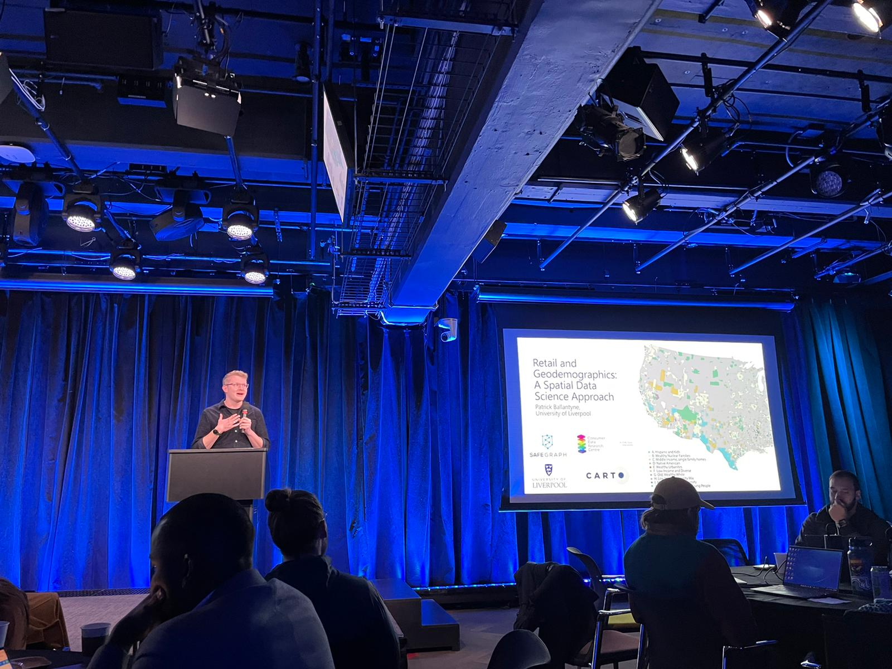

## About Me

I was born in 1997 in Luton, Bedfordshire, UK. I am currently reading for an MSc and PhD in Data Analytics at the [University of Liverpool](https://www.liverpool.ac.uk/).

## Education 

* 1997-2007: Educated at [Sacred Heart Primary School, Luton](https://www.sacredheartluton.org.uk/).
* 2008-2015: Educated at [Cardinal Newman Catholic School, Luton](https://www.cardinalnewmanschool.net/page/default.asp?title=Home&pid=1), obtaining 12 GCSE's and 5 A-Levels
* 2015-2018: Studied and graduated from the [University of Liverpool](https://www.liverpool.ac.uk/) with a First Class Bachelor's of Science in Physical Geography
* 2018-Present: Reading from an Integrated MSc and PhD in Data Analytics and Society at the Centre for Doctoral Training (CDT) at the [University of Leeds](https://lida.leeds.ac.uk/study-training/datacdt/), with research based at the University of Liverpool. Sponsorship for research has been provided by both the ESRC and GEOLYTIX.

## Research Interests

- Understanding and defining global retail centres, specifically what they are composed of.
- Developing and integrating new sources of ancillary data for reserach - e.g. aerial imagery, remote sensing.
- Learning new programming languages like python, R and javascript.

## Contact Details

Patrick Ballantyne

Department of Environmental Sciences

Roxby Building, University of Liverpool

Chatham Street

L7 7BD

Email: sgpballa@liverpool.ac.uk
